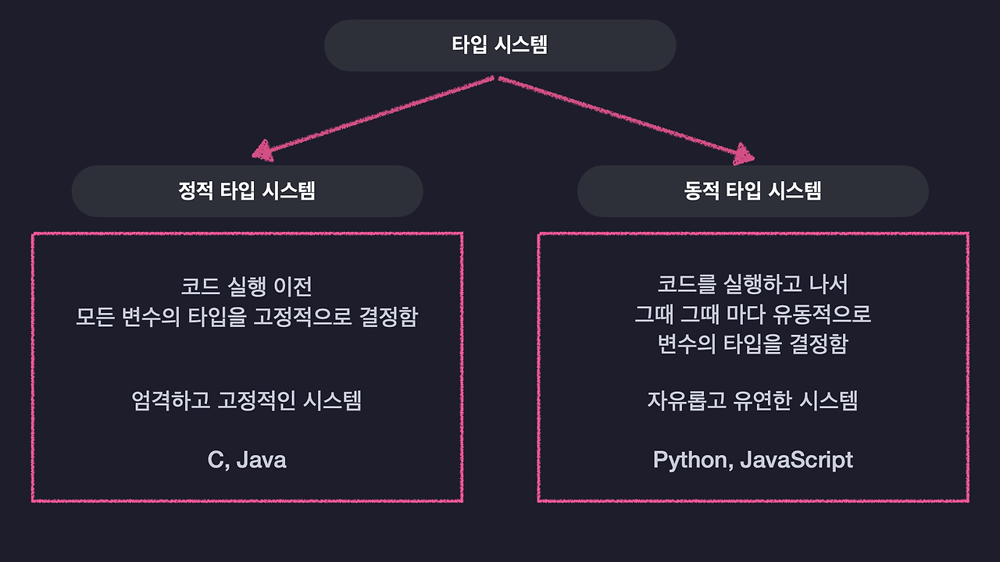
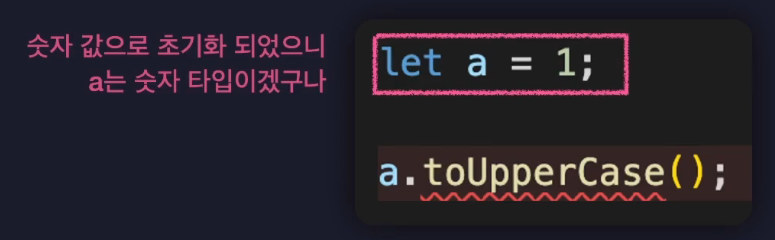
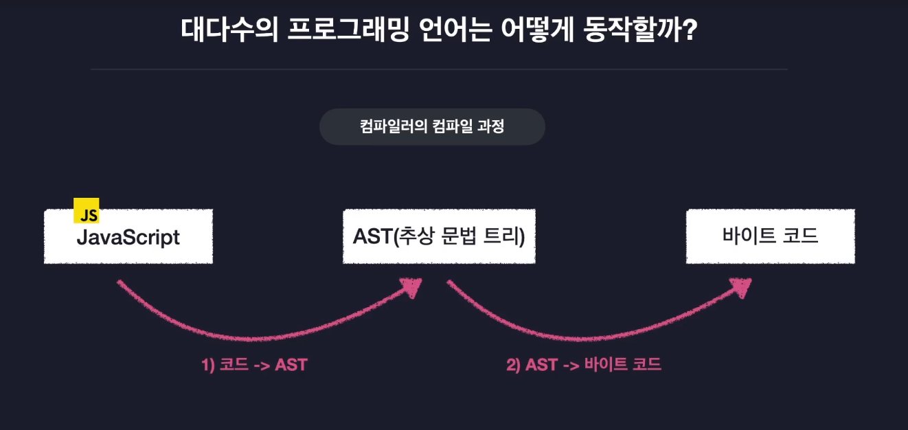
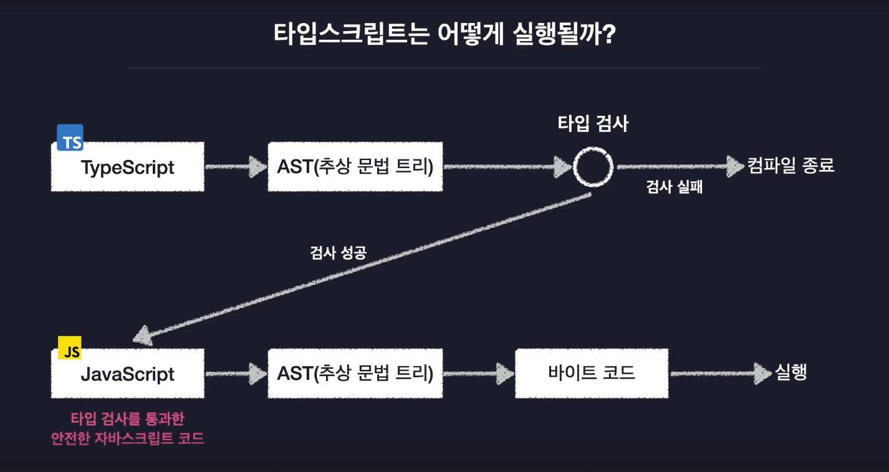

# 타입스크립트
- c# 개발자인 앤더스 헤일즈버그가 개발
- 자바스크립트의 확장판
- 자바스크립트를 더 안전하게 사용할 수 있도록 **타입 관련 기능들을 추가한** 언어

### 왜 공부하나
- JS는 웹에서 간단 상호작용을 위해 개발
- 하지만 node.js 탄생 이후 -> JS는 웹 뿐만 아니라 어떤 프로그램이든 활용 가능
- 하지만 JS는 유연한 문법을 가지지만 **버그 발생 가능성이 높음**  
-> _안정성을 확보한 타입스크립트 탄생_

#### 자바스크립트 한계
> 타입 시스템: 언어의 타입 관련 문법 체계  
> _모든 프로그래밍 언어는 타입 시스템을 가지고 있다_



- 자바스크립트는 **동적 타입 시스템**
    - 실행 돌리다가 어느샌가 오류 발생 가능성 ↑
    - 정적 타입 시스템은 오류를 미리 알려줌
- 이를 해결하기 위해 타입스크립트는...
    - 정적 타입 시스템 + 동적 타입 시스템
    - 타입 정의 가능
    - 모든 변수에 타입을 일일이 지정 안해도 자동으로 알아서 타입 추론
    - 점진적 타입 시스템



<br>

### 타입 스크립트 동작 원리





<br>

### 타입스크립트 컴파일러 옵션

```json
{
  "compilerOptions": {
    "skipLibCheck": true,
    "target": "ESNext",
    "module": "esnext",
    "outDir": "dist",
    "strict": false,
    "moduleDetection": "force"
  },
  "include": ["src"]
}
```
- include: `src`폴더 내의 `ts` 파일들을 컴파일 대상 포함
- skipLibCheck: `node_modules` 안에 있는 타입 정의 파일(`.d.ts`) 검사를 건너뜀
- target: 트랜스파일된 자바스크립트 코드가 어떤 ECMAScript 버전을 따를지 결정
    - ts -> js로 변환할때 ECMAScript 버전을 ES modules 방식으로 하겠다 (`ESNext`: 최신 버전)
- module: 트랜스파일된 코드에서 어떤 모듈 시스템을 쓸지 결정
    - ES modules로 모듈 시스템 지정 (`ESNext`: 최신 버전)
- outDir: 트랜스파일된 JS 파일이 저장될 디렉토리
- strict: 타입을 엄격하게 검사. false는 엄격하게 검사하지 않겠다는 뜻
    - 타입 추론이 느슨해짐
    - 예) 매개변수 타입을 지정하지 않아도 됨
    - 원래 매개변수 타입은 꼭 지정해야함
- moduleDetection: 타입스크립트가 어떤 파일을 "모듈"로 인식할지 결정하는 옵션
    - 타입스크립트는 전역모듈. 
    - 때문에 다른 파일에 같은 이름의 변수를 두면 오류가 난다. `force`는 각각의 파일을 독립모듈로 인식하게 함