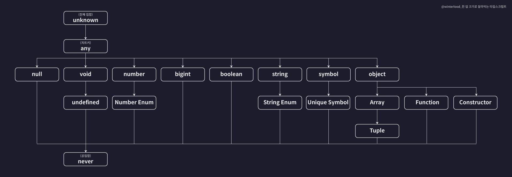
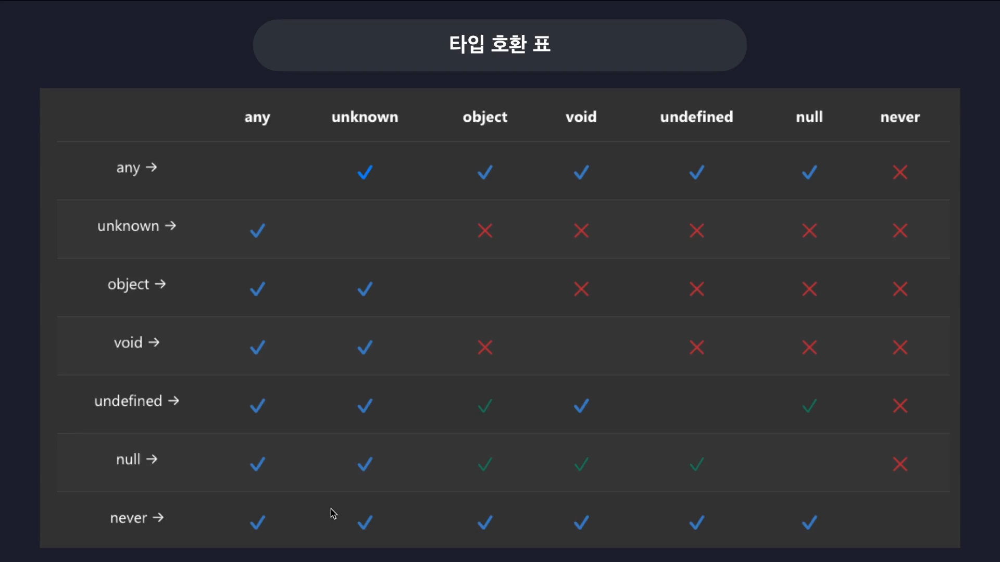

# 타입 스크립트 이해

<br>

- 타입스크립트가 말하는 타입은 **집합**이다
  - 동일한 속성과 특징들을 갖는 여러 개의 값들을 모아둔 집합
- 타입끼리 계층적 구조를 가짐
  - number Type: 다른 타입을 포함하는 큰 타입 -> **부모 타입**, **슈퍼 타입**
  - number literal Type: 다른 타입에 포함되는 타입 -> **자식 타입**, **서브 타입**
- 타입 호환성: 어떤 타입을 다른 타입으로 취급해도 괜찮은지 판단하는 것
  - 자식 타입 -> 부모 타입으로 호환 가능: `업 캐스팅`
  - 그 반대는 대부분의 상황에서 허용 X: `다운 캐스팅`

<br><br>

### 타입 계층도와 함께 기본타입 살펴보기



<br>

Unknown 타입

- **전체 집합**
- 타입의 최상단에 위치

```ts
function unknwonExma() {
  let a: unKnown = 1;
  let b: unKnown = true;
  let c: unKnown = null;
  /// ... 모든 값을 넣을 수 있습니다.
  //  업캐스팅
  let unknownVar: unknown;

  let num: number = unknownVar;
  let str: string = unknownVar;
  // 모든 값을 넣을 수 없습니다.
  // 다운 캐스팅
}
```

<br>

Never 타입

- 공집합
- 모든 집합의 부분집합

```ts
function neverExam() {
  function neverFunc(): never {
    while (true) {}
  }

  let num: number = neverFunc();
  let str: string = neverFunc();
  // never 타입은 모든 타입의 sub 타입이기때문에 그 어떤 타입 변수에도 넣을수있습니다
  // 업캐스팅
}
```

<br>

Void 타입

```ts
function voidExam() {
  function voidFunc(): void {
    console.log("hi");
    return undefined;
  }

  let voidVar: void = undefined;
}
```

<br>

Any 타입

- 치트키 타입
- 타입 계층도를 완전히 무시
- 모든 타입의 다운캐스팅 업캐스팅 가능 (단! never 타입을 제외하고)

```ts
function anyExam() {
  let unknownVar: unknown;
  let anyVar: any;
  let undefinedVar: undefined;
  let neverVar: never;
  anyVar = unknownVar;
  //  다운 캐스팅 해도 문제가 없습니다.
  undefinedVar = anyVar;
  //  다운 캐스팅 해도 문제가 없습니다.
  neverVar = anyVar;
  // 네버 타입에는 그 어떤 타입도 다운 캐스팅 할 수 없습니다.
}
```

<br>

타입 호환성



<br><br>

### 객체 타입 호환성

```ts
type Animal = {
  name: string;
  color: string;
};

type Dog = {
  name: string;
  color: string;
  breed: string;
};

let animal: Animal = {
  name: "기린",
  color: "yellow",
};

let dog: Dog = {
  name: "돌돌이",
  color: "brown",
  breed: "푸들",
};

animal = dog; // 에러가 일어나지 않습니다
dog = animal; // 에러가 일어 납니다.
```

- **구조적 타입 시스템**이기 때문에 dog에 animal을 넣을 수 없다
  - 구조적 타입 시스템: 객체의 모양(shape, 구조) 을 기준으로 타입 호환성을 판단하는 시스템
  - **속성이 맞으면 같은 타입**으로 봄
  - `animal`이 기대하는 건 `name`과 `color` 속성 두 개뿐
  - `dog`는 `name`, `color`에 더해 `breed`까지 있으므로, 최소 조건을 만족
    <br>

<br>

```ts
type Book = {
  name: string;
  price: number;
};

type ProgrammingBook = {
  name: string;
  price: number;
  skill: string;
};

let book: Book;
let programmingBook: ProgrammingBook = {
  name: "한 입 크기로 잘라 먹는 리액트",
  price: 33000,
  skill: "reactjs",
};

book = programmingBook;

let book2: Book = {
  name: "한 입 크기로 잘라 먹는 리액트",
  price: 33000,
  skill: "reactjs", // 오류가 출력됩니다
};
```

- 초과 프로퍼티 검사
  - 객체 리터럴을 사용하면 발동하는 검사로 객체 타입 변수를 초기화할떄 검사

<br><br>

### 대수 타입

- 여러 개의 타입을 합성해서 새롭게 만들어낸 타입
- **합집합 타입**과 **교집합 타입**이 존재

<br>

#### 합집합 - Union 타입

```ts
let a: string | number;
a = 1;
a = "hello";

let arr: (number | string)[] = [1, "hello"];
```

<br>

객체 합집합

```ts
type Dog = {
  name: string;
  color: string;
};

type Person = {
  name: string;
  language: string;
};

type Union1 = Dog | Person;

let union1: Union1 = {
  name: "",
  color: "",
};

let union2: Union1 = {
  name: "",
  language: "",
};

let union3: Union1 = {
  name: "",
  color: "",
  language: "",
};

let union4: Union1 = {
  // 오류가 출력
  name: "",
};
```

- union1은 `Dog`타입에 포함
- union2는 `Person`타입에 포함
- union3은 `Dog`타입과 `Person`타입의 교집합에 포함
- union4는 어디에도 포함 X

<br>

#### 교집합 - Intersection 타입

```ts
let variable: number & string;
```

- 기본타입으로 교집합 타입을 만들면 거의 Never 타입이 된다.

<br>

객체 교집합

```ts
type Dog = {
  name: string;
  color: string;
};

type Person = {
  name: string;
  language: string;
};

type Intersection = Dog & Person;

let intersection1: Intersection = {
  name: "",
  color: "",
  language: "",
};
```
